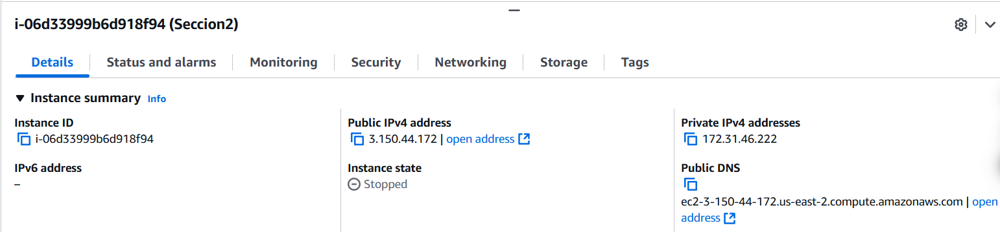
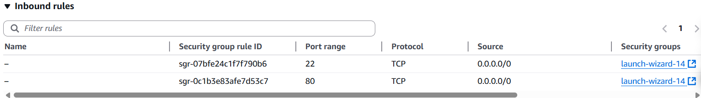

# FrontEnd + Docker Compose – Sistema de Productos y Categorías.

Mateo Criollo - 30/07/2025 - NRC: 2366


## Documentación
Este nuevo proyecto, basado en los servicios de **Products** y **Categories**, busca implementar un sistema completo con Frontend, Backend y Base de Datos, utilizando una arquitectura orientada a la simulación de **microservicios**. Cada componente se ejecuta de forma independiente en su propio contenedor Docker, lo que permite una mayor escalabilidad, mantenimiento y despliegue modular.

El objetivo principal es demostrar cómo diferentes servicios pueden interactuar de manera eficiente en un entorno desacoplado, haciendo uso de herramientas modernas como Angular 19 para el frontend, Spring Boot para los microservicios REST y MySQL como base de datos relacional, todo orquestado a través de Docker Compose.
## Tecnologías Utilizadas

- 🧩 Java 17 
- 🧩 Spring Boot
- 🧩 Spring Data JPA
- 🗃️ MySQL
- 🐋Docker
- 🐙 Docker Hub
- 🧩Jakarta
- 🅰️ Angular
- 🟢 Ngnix


## 🔗 Links de los archivos creados
### 📁 Repositorio del código fuente
Para acceder de forma rápida y sencilla al codigo que permitió crear todo esto:
 - 🔗 [https://github.com/Teo344/Criollo_Mateo_Sistema_Producto_Categoria.git](https://github.com/Teo344/Criollo_Mateo_Sistema_Producto_Categoria.git)
### 📦 Imágenes en Docker Hub
Para poder conocer donde se encuentra la imágen de los diferentes servicios creados y además del frontend de Angular se encuentran a continuación :
 - 🔗 [gabrielmt2004/frontend:v1](https://hub.docker.com/repository/docker/gabrielmt2004/frontend/tags)
  - 🔗 [gabrielmt2004/backend-products:v1](https://hub.docker.com/repository/docker/gabrielmt2004/backend-products/tags)
   - 🔗 [gabrielmt2004/backend-categories:v1](https://hub.docker.com/repository/docker/gabrielmt2004/backend-categories/tags)

## 📁 Estructura
```bash
Criollo_Mateo_Sistema_Producto_Categoria/
├──backend              #Aquí se encuentra todos los servicios definidos en el trabajo
├──frontend             #Aquí se encuentra se encuentra todo el programa de Angular
├──docker-compose.yml   #Este archivo levanta todo el programa,
                        creando las imagenes localmente  
├──docker-compose.yml   #Este archivo levanta todo el programa, pero cargando las
                        imágenes del repositorio de docker Hub
```
## FAQ

#### ¿Exisistió problemas al consumir los servicios del frontend en el backend?

Sí, en este caso hubó un problema el cual era los permisos que el mismo frontend y el navegador impedía consumir y traer los respectivos datos.
Debido a eso en los servicios se decidio crear una clase que logre y de los diferentes permisos para los servicios de **products** y **categories**

```java
@Configuration
public class CorsConfig {
    @Bean
    public WebMvcConfigurer corsConfigurer() {
        return new WebMvcConfigurer() {
            @Override
            public void addCorsMappings(CorsRegistry registry) {
                registry.addMapping("/**")
                    .allowedOrigins("http://localhost:4200")
                    .allowedMethods("GET", "POST", "PUT", "DELETE", "OPTIONS")
                    .allowedHeaders("*");
            }
        };
    }
}
```

#### ¿Exisitó problemas al levantar todos los contenedores?
En este caso sí, debido a que el docker-compose levantaba primero los contenedores de los servicios antes que la base de datos; provocando que los contenedores de los servicios se cierren por no encontrar la base de datps y que toque levantarlos manualmente. Para ello, en cada servicio se definió un **entrypoint.sh** que logra detectar cuando se cree la base de datos y que se levante el contenedor según el servcicio.


```sh
#!/bin/sh

echo "⏳ Esperando a que la base de datos esté lista..."

# Espera activa hasta que el puerto 3306 de MySQL esté disponible
while ! nc -z mysql-db 3306; do
  echo "⏳ Aún esperando a MySQL..."
  sleep 2
done

echo "✅ Base de datos disponible. Iniciando Categories..."

exec java -jar [archivo .jar]
```

Y el dockerfile de cada servicio, en la etapa de crear la imágen se cambio por esto:

```dockerfile
FROM openjdk:17-jdk-alpine

WORKDIR /app

# Crear carpeta para logs si es necesario
RUN mkdir ./logs

# Copiar JAR
COPY --from=builder /app/target/categories-0.0.1-SNAPSHOT.jar .

# Copiar entrypoint y darle permisos
COPY entrypoint.sh .
RUN chmod +x entrypoint.sh

# Exponer puerto definido por variable de entorno
EXPOSE $PORT

# Usar entrypoint que espera la DB
ENTRYPOINT ["./entrypoint.sh"]
```

##  🛠️Despliegue de todas las imágenes a DockerHub
### 🚀Creación del servicio products
Para esto se creó la respectiva imágen:
```bash
docker image tag criollo_mateo_sistema_producto_categoria-backend-products:latest 
gabrielmt2004/backend-products:v1
```
Y se subió en docker Hub
```bash
docker push gabrielmt2004/backend-products:v1
```

### 🚀Creación del servicio categories
Para esto se creó la respectiva imágen:
```bash
docker image tag criollo_mateo_sistema_producto_categoria-backend-categories:latest 
gabrielmt2004/backend-categories:v1
```
Y se subió en docker Hub
```bash
docker push gabrielmt2004/backend-categories:v1
```

### 📤Creación de la imágen de Angular
Para poder crear la imágen en donde se realizó el siguiente comando
```bash
docker image tag criollo_mateo_sistema_producto_categoria-frontend:latest 
gabrielmt2004/frontend:v1
```
Y se subió en docker Hub
```bash
docker push gabrielmt2004/frontend:v1
```


## 🚀Instalación

Para poder utilizar todo el programa de forma correcta y en el puerto **http://localhost:4200** se desarrolló dos docker-compose,para la creación de imágenes localmente; **pero donde es necesario descargar el proyecto entero desde GitHub.**

```bash
docker-compose -f docker-compose.yml up
```
Y este docker-compose2 para poder utilizar las imágenes del docker Hub, **sin necesidad de descargar todo el proyecto** solamente el docker-compose2:

```bash
docker-compose -f docker-compose2.yml up 
```
## 🚀Preparación del Servicio en AWS
En está nueva versión del programa para poder desplegar en un servicio web como lo es AWS. Se debió tomar nuevas consideraciones al momento de realizarlas.

### Creación de la instancia para AWS
El servicio elegido fue AWS, en la cual se creó la instancia con estas especificaciones:




Donde también denotamos que se creó un servidor de Ubuntu y que también nosotros especificamos los puertos de acceso para que pueda salir y comunicarse con el exterior.



También, para evitar que al momento de detener la instancia, por temas de económicos, se cambié la ip del servicio; entonces se creó una ip elástica que siempre se mantiene a pesar de que se detenga o cualquier otro problema, está es: **3.150.44.172**

Y por ultimó para poder acceder mediante Git Bash y poder cargar correctamente el docker-compose se tiene presente el archivo **gabriel21.pem** para acceder y hacer los cambios pertinentes.

### Modificación del frontend
Debidó a que el frontend se conectaba con localhost, al momento de llevarlo a AWS; ocurre una pérdida de comunincación con los servicios del backend, porque este funciona con la ip correspondiente, para ello se modificó el **enviroment.ts** del frontend para que se direccione correctamente:
```ts
export const environment = {
  production: false,
  apiUrlProducts: '/api/products',
  apiUrlCategories: '/api/categories'
};
```

De igual forma, hubó problemas con el servidor de Ngnix; porque al establecer las diferentes rutas, el proxy nos causa problemas por temas de CORS y permisos para el navegagor, por ende se modificó el mismo agregando lo siguiente:
```conf
# === PRODUCTS ===
# SIN barra final (exacto): /api/products
location = /api/products {
  proxy_pass http://backend-products:8080/api/products;
  proxy_set_header Host $host;
  proxy_set_header X-Real-IP $remote_addr;
}

# CON barra final y subrutas: /api/products/...
location /api/products/ {
  proxy_pass http://backend-products:8080/api/products/;
  proxy_set_header Host $host;
  proxy_set_header X-Real-IP $remote_addr;
}

# === CATEGORIES ===
location = /api/categories {
  proxy_pass http://backend-categories:8080/api/categories;
  proxy_set_header Host $host;
  proxy_set_header X-Real-IP $remote_addr;
}

location /api/categories/ {
  proxy_pass http://backend-categories:8080/api/categories/;
  proxy_set_header Host $host;
  proxy_set_header X-Real-IP $remote_addr;
}
```
Con este ultimó cambio realizado al frontend; entonces se decidió en crear una nueva imagen en docker-hub para evitar convenientes y que sea de fácil acceso, si desea acceder se realiza mediante lo siguiente:

🔗 [gabrielmt2004/img-frontend-servicio:v13](https://hub.docker.com/repository/docker/gabrielmt2004/img-frontend-servicio/general)


Y por ultimó, se creo un nuevo archivo compose 🔗 [docker-compose3.yml](https://github.com/Teo344/Criollo_Mateo_Sistema_Producto_Categoria/blob/main/service/docker-compose3.yml).
Este nuevo docker compose cambió el hecho de exponer los puertos publicamente, sino que ahora unicamente existe el puerto 8080; para la conexión con el frontend y el frontend es el único que se accede con un puerto publico **80:80**

### Creación del servicio.
Primeramente tanto el archivo **docker-compose3.yml** y el **gabriel21.pem** se coloca dentro de una carpeta para un mejor manejo. para este caso la carpeta se llamara **Service**.
Luego utilizamos un git bash para poder acceder y controlar la instancia correspondiente

```bash
cd /c/Users/MSI/Desktop/Service
```

Ya dentro de la carpeta, entonces se conectó a la instancia mediante la ip elástica que hemos mencionado:

```bash
ssh -i gabriel21.pem ubuntu@3.150.44.172
```

Entonces al ingresar en la instancia y poder cargar el docker-compose3.yml dentro de la misma descargamos el entorno de docker:

```bash
sudo apt update
sudo apt install -y docker.io docker-compose
sudo systemctl enable docker --now
sudo usermod -aG docker ubuntu
```

Salimos de esta para refrescar la instancia.

```bash
exit
```
Y antes de volver a entrar a la instancia, ahora subimos el docker-compose3 dentro de la misma para poder levantar todos los contenedores de esta forma:
```bash
scp -i gabriel21.pem docker-compose3.yml ubuntu@3.150.44.172:~
```
Y al entrar nuevamente, ahora realizamos y utilizamos el docker-compose3:
```bash
docker-compose -f docker-compose3.yml up 
```

# Acceso al Servicio

Luego de esperar a que todos los contenedores se creen. Entonces ahora accedemos mediante el siguiente link para poder visulizar todo el proyecto:


🔗 [3.150.44.172/home](http://3.150.44.172/home)


## 🛠️Soporte
Para poder solventar cualquier duda, comunicarse con el correo mgcriollo1@gmail.com

